# Prediction Market LayerZero Resolver Diagrams

This document contains interaction diagrams for both the complex and simplified versions of the LayerZero-based PredictionMarket Resolvers.

## Complex Version Architecture

### System Overview
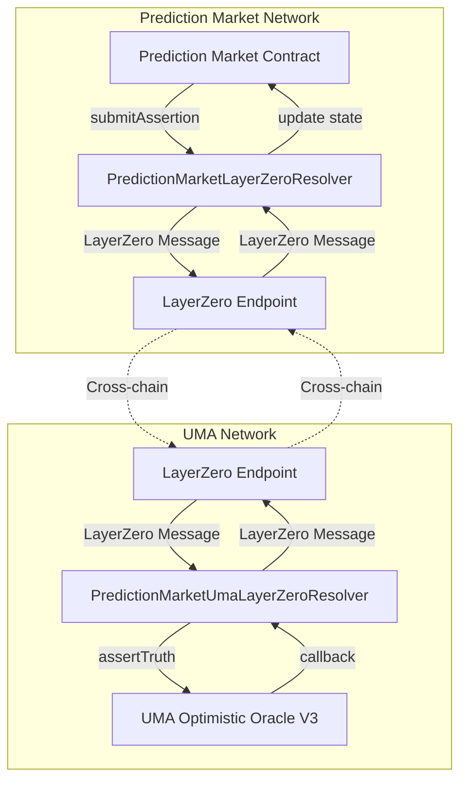

### Complex Version Flow
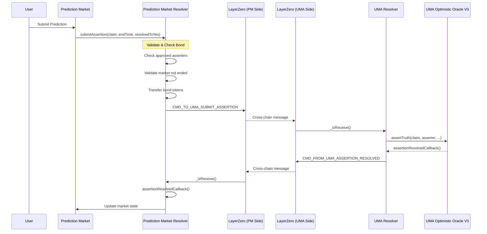

## Simplified Version Architecture

### System Overview
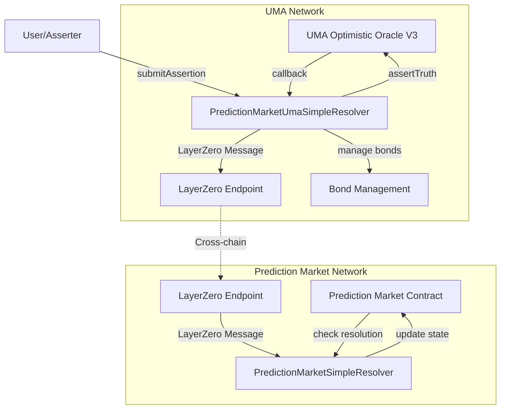

### Simplified Version Flow
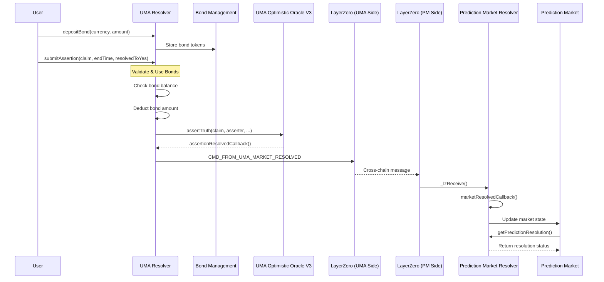

## Message Flow Comparison

### Complex Version Messages
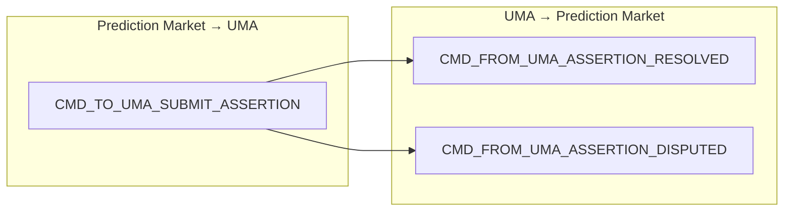

### Simplified Version Messages
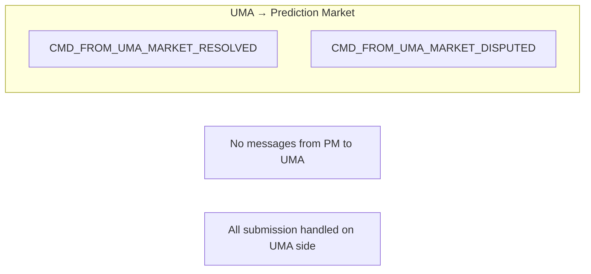

## State Management Comparison

### Complex Version State
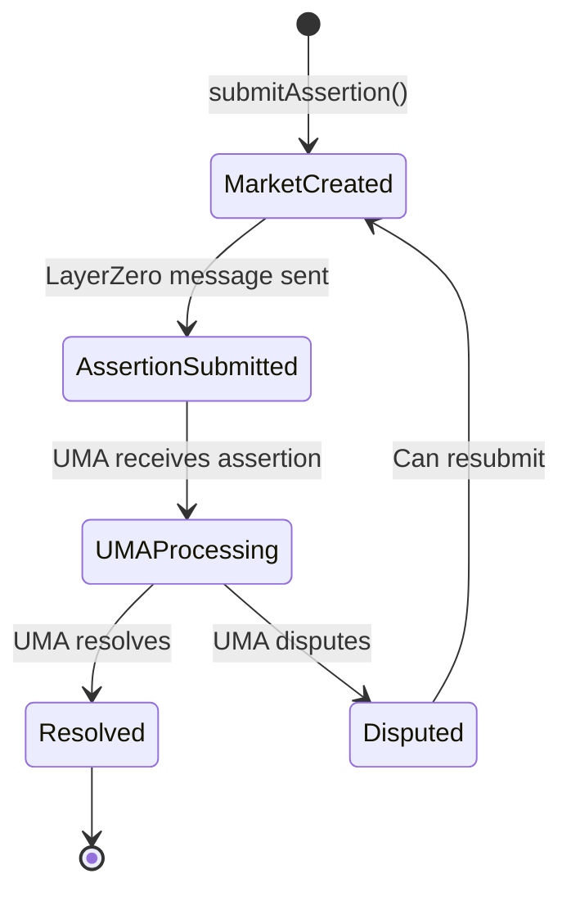

### Simplified Version State
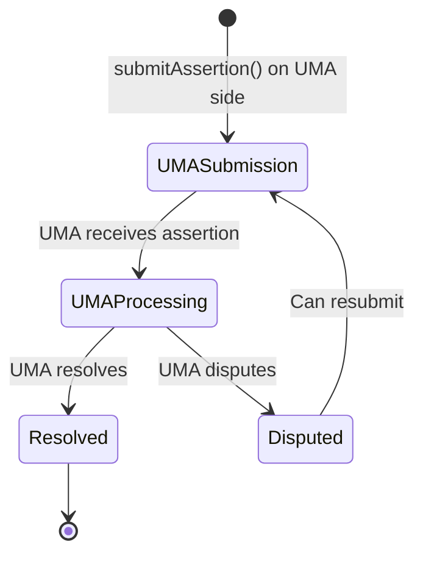

## Bond Management Comparison

### Complex Version Bond Flow
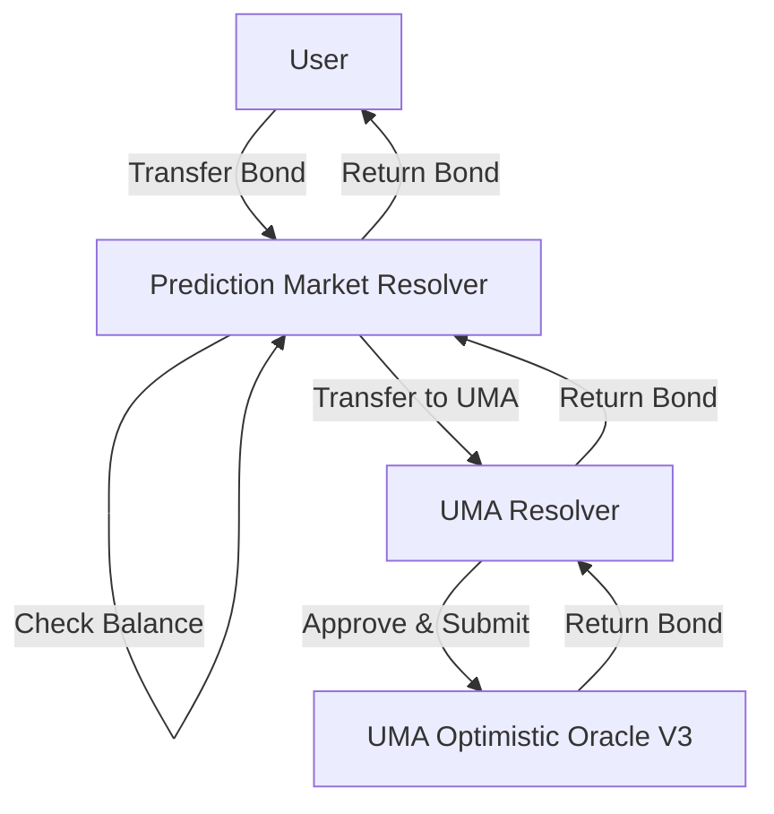

### Simplified Version Bond Flow
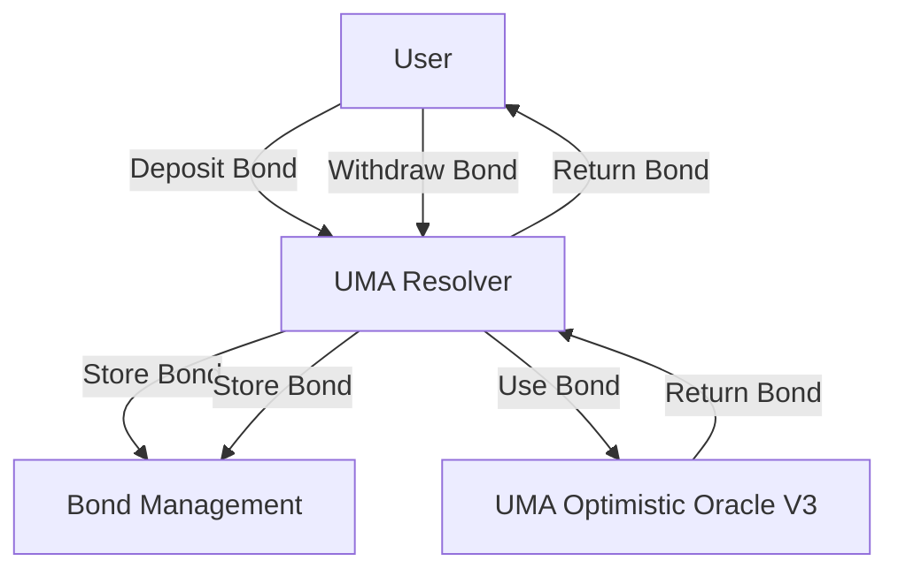

## Deployment Architecture

### Complex Version Deployment
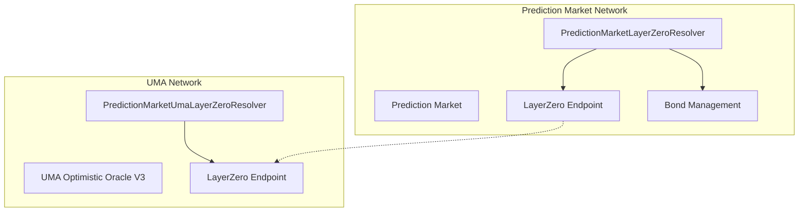

### Simplified Version Deployment
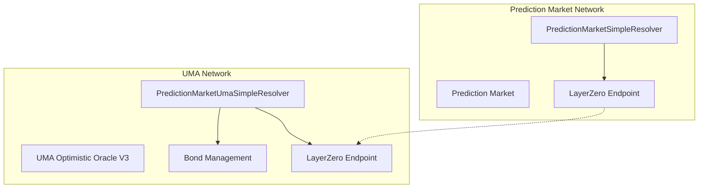

## Error Handling Flows

### Complex Version Error Handling
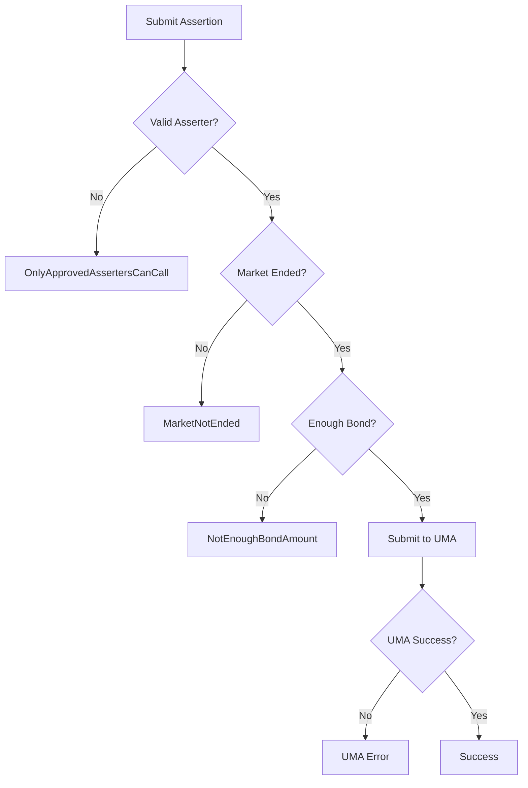

### Simplified Version Error Handling
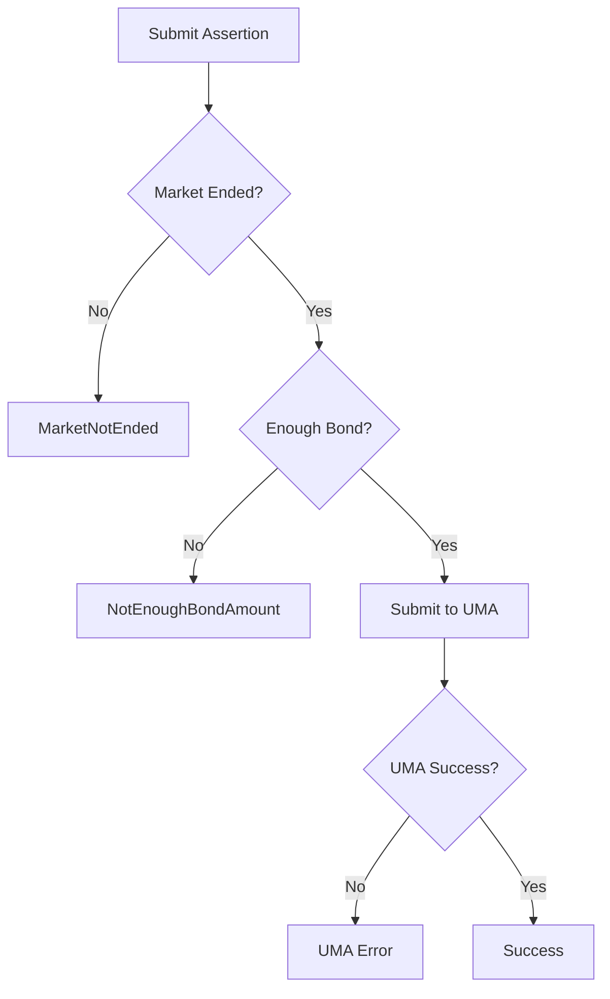

## Key Differences Summary

| Aspect | Complex Version | Simplified Version |
|--------|----------------|-------------------|
| **Message Direction** | Bidirectional | Unidirectional |
| **Bond Management** | Cross-chain | UMA side only |
| **Assertion Submission** | PM side | UMA side |
| **State Complexity** | High | Low |
| **Deployment** | Complex | Simple |
| **Message Types** | 3 | 2 |
| **Access Control** | Both sides | UMA side only |
| **Maintenance** | Complex | Simple |

## Security Considerations

### Complex Version Security
- Cross-chain bond transfers
- Multiple access control points
- Complex state synchronization
- Bidirectional message validation

### Simplified Version Security
- Centralized bond management
- Single access control point
- Simple state management
- Unidirectional message flow
