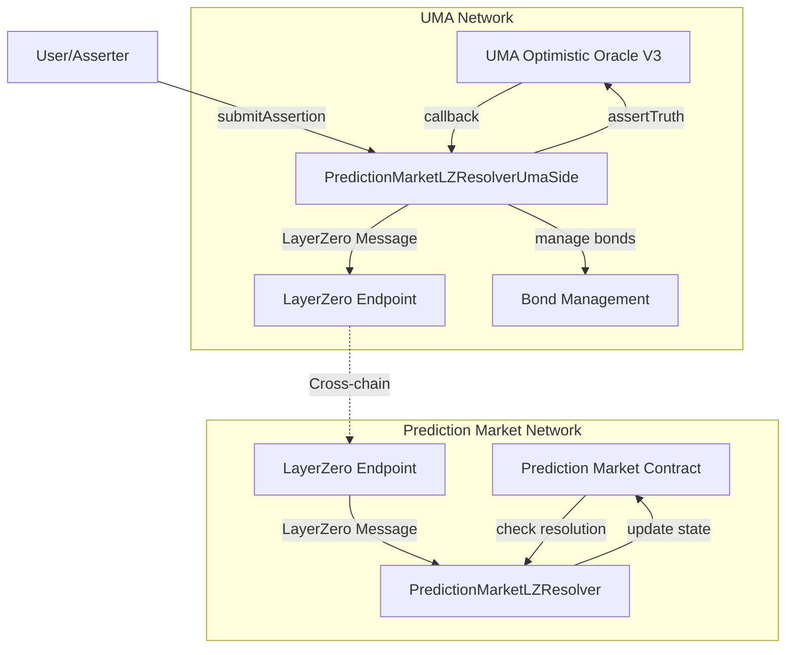
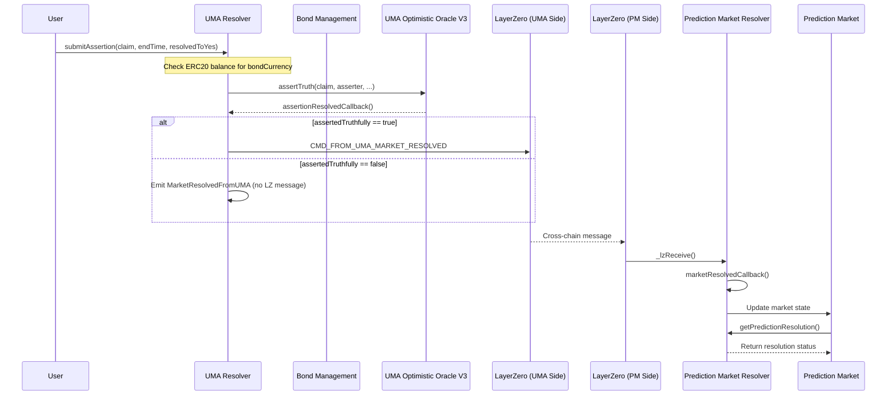
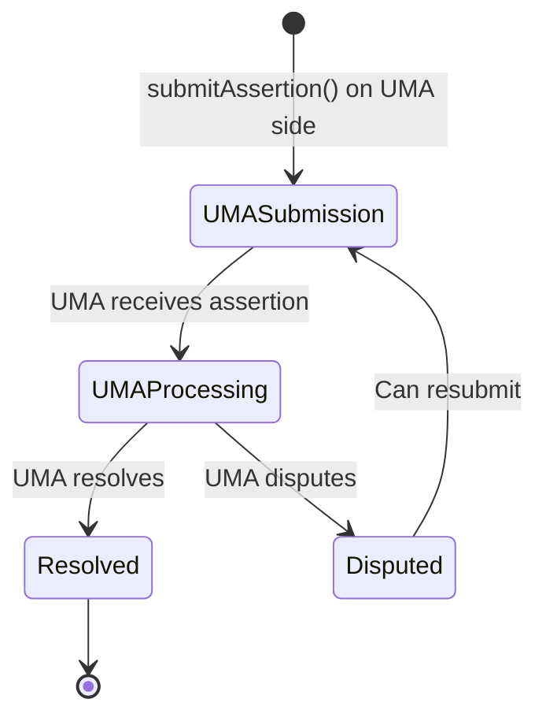
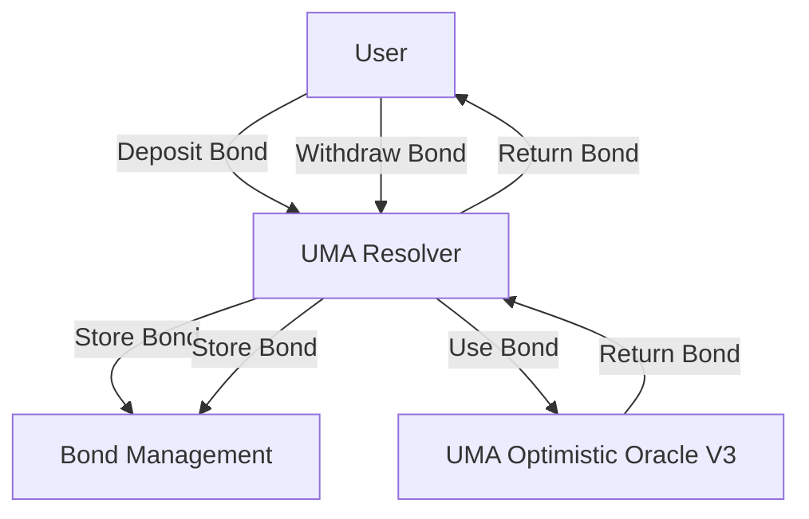
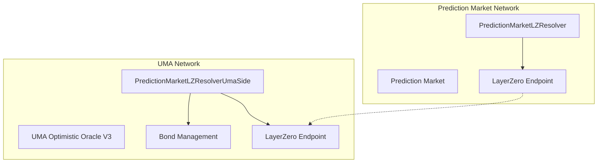
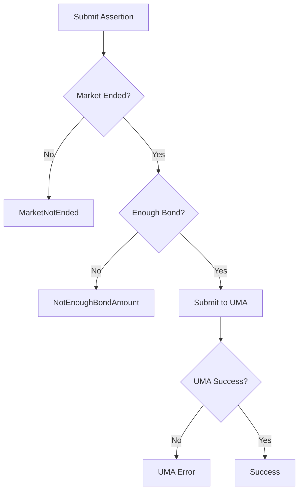

# Prediction Market LayerZero Resolver Diagrams

This document contains interaction diagrams for the LayerZero-based PredictionMarket Resolvers.

## System Architecture

### System Overview

### System Flow

## Message Flow

### System Messages

```mermaid
graph LR
    subgraph "UMA → Prediction Market"
        A[CMD_FROM_UMA_MARKET_RESOLVED]
    end
    
    Note1[No messages from PM to UMA]
    Note2[LZ only on truthful resolutions]
```

## State Management

### System State Flow

## Bond Management

### Bond Flow

## Deployment Architecture

### System Deployment

## Error Handling

### System Error Handling

## Security Considerations

- Centralized bond management
- Single access control point
- Simple state management
- Unidirectional message flow
